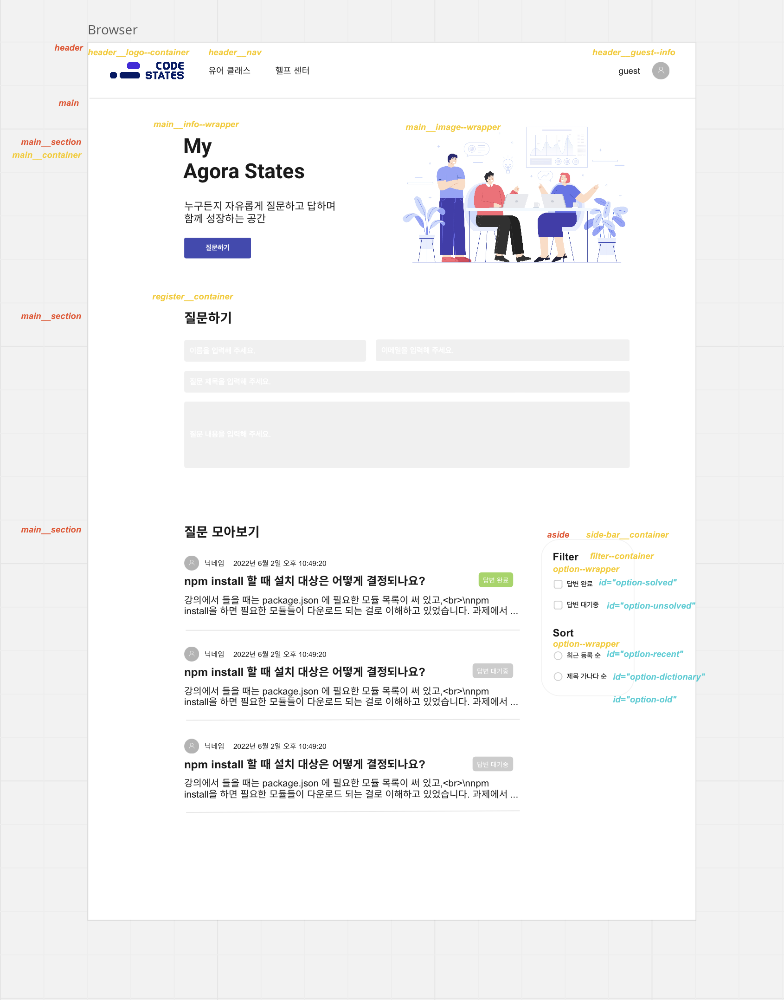
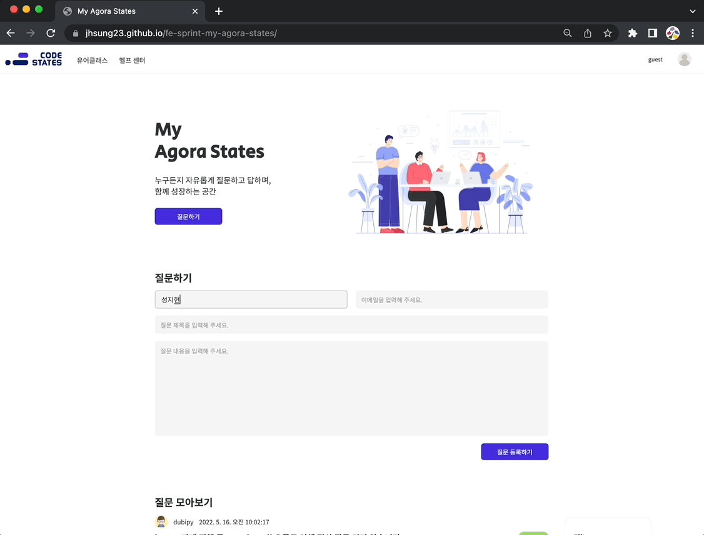

# 아고라 스테이츠 구현하기

주어진 데이터를 이용해 질의응답 페이지와 기능을 구현하는 과제

# 설계 (디자인)

# 기능 목록

1. 질문 등록하기
   - 질문하기 버튼 클릭 시 숨겨져 있던질문 폼 보여주기
   - 등록하기 버튼 클릭 시 유효성 검사 및 질문 모아보기 리스트에 추가
2. 질문 목록 필터링
   - 답변 완료 게시물 필터링
   - 답변 대기중 게시물 필터링
   - 공지 게시물 필터링
3. 질문 목록 정렬
   - 최근 등록 순 정렬
   - 오래된 등록 순 정렬
   - 제목 가나다 순 정렬
4. 페이지네이션
   - 한 페이지 당 최대 10개의 게시물

# 시연 이미지

# 배포 링크

https://jhsung23.github.io/fe-sprint-my-agora-states/

# License

<a href="http://www.freepik.com">Designed by pikisuperstar / Freepik</a>
